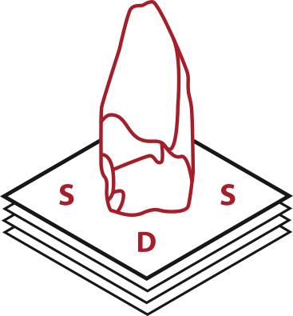

# sdsbrowser -- an R Shiny Application for visualisation and analysis of SDS stone artefact data

This paper ...

## Abstract

SDS (Systematic and Digital documentation of Stone artefacts) is a recording system for stone artefacts proposed by Drafehn et al. 2008 [1]. It was created as an uniform coding and standardized listing system of the conventional attributes recorded at lithic inventories to enable quantitative and comparative analysis. The variable collection and data structure in SDS was compiled from several established documentation systems, most notably Zimmermann 1977 (see [1]).

Naturally its long history caused technological anachronisms in the way it stores data, complicating the application of modern computational tools and methods. Nevertheless the SDS system is still in use and was implemented for material study in many archaeological projects over the last ten years. These separate individual datasets are now in danger of falling into oblivion although they are a valuable resource for cross-context data comparison as intended by the SDS creators.

This paper presents our attempt to 1. collect, standardise and modernise SDS data and metadata, 2. analyse and compare different datasets with tools provided in an own R package sdsanalysis and 3. publish and visualise the datasets with the webapp sdsbrowser to make them accessible for future use. Increasing the visibility and usability of old data is of crucial importance for archaeology and the combination of R Package and Shiny App is a powerful framework to simplify this task.

***

[1] A. Drafehn/M. Bradtmöller/D. Mischka, SDS – Systematische und digitale Erfassung von Steinartefakten. Journal Of Neolithic Archaeology 10, 2008. doi:10.12766/jna.2008.25
