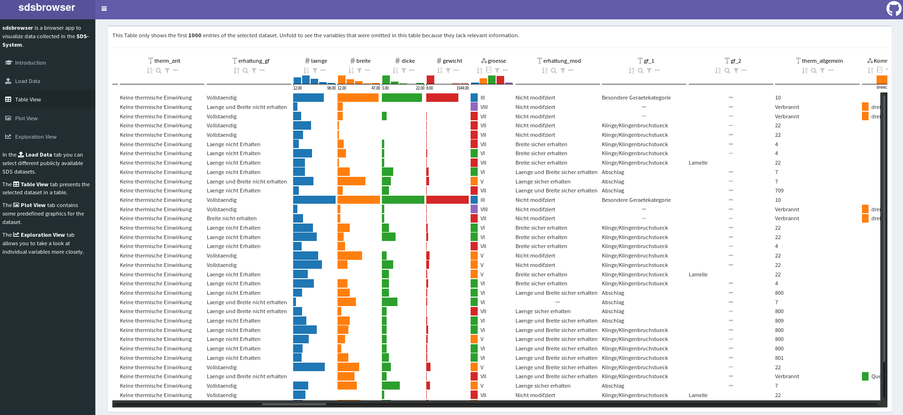

```{r, echo = FALSE}
library(magrittr)

# https://stackoverflow.com/questions/25646333/code-chunk-font-size-in-rmarkdown-with-knitr-and-latex
def.chunk.hook  <- knitr::knit_hooks$get("chunk")
knitr::knit_hooks$set(chunk = function(x, options) {
  x <- def.chunk.hook(x, options)
  ifelse(options$size != "normalsize", paste0("\\", options$size,"\n\n", x, "\n\n \\normalsize"), x)
})
knitr::opts_chunk$set(echo = TRUE, cache = TRUE)
```

## TOC

\huge

- Data acquisition and sharing in archaeology
- The SDS System
- Making SDS data accessible: \newline R package + Shiny Webapp
- Lessons for the future


# Data acquisition and sharing

## Bad hidden data

\underline{Problems!}

- Archaeology produces **Bad Data** (pretty shitty Big Data)
  - **Volume** -- low end of the spectrum
  - **Variety** -- a lot! and a significant lack of metadata
  - (Velocity)
  - **Veracity** -- highly different data quality
- Lack of data (and code) sharing
- Lack of long term storing strategies

\underline{Solutions?}

- Positive pressure
  - Funding and Journal requirements 
  - Open Science and Reproducible Research Movement

- Tools and enabling features
  - Data Storage Providers (e.g. *Archaeology Data Service*)
  - Data Journals (e.g. *Journal of Open Archaeology Data*)
  - Licensing 
  - new **Software Frameworks** that simplify good data sharing practices


# The SDS System 

## SDS -- The Idea

A. Drafehn/M. Bradtmöller/D. Mischka, SDS – Systematische und digitale Erfassung von Steinartefakten (Arbeitsstand SDS 8.05). Journal Of Neolithic Archaeology 10, 2008. [doi:10.12766/jna.2008.25](https://doi.org/10.12766/jna.2008.25)

\vspace{10px}

> The following contribution offers a **recording system for stone artefacts**. This **compilation of existing systems** from the Upper Paleolithic to the Neolithic should serve as a starting point for **systematic and quantitative analysis** with a uniform **coding** and standardized listing system of the **conventional attributes recorded at lithic inventories**. Therewith a valuable basis for comparative analysis and digital exchange of the data should be guaranteed. 

\underline{Features:}

- Description of **individual** artefacts
- **~200** variables (*color*, *weight*, *preservation*, and specific features by artefact type) with **>1300** predefined values/categories
- Table layout with separate **form sheets**
- Digit based **value encoding**: value "05" in variable *color* means "green"

## SDS -- The Idea

\footnotesize

```{r, echo = FALSE}
" 'L', 'A', 0, 5, 2, 0, 0, 9, 1, 0, 8, 0, 2, 1, 0, 0, '...'
  'L', 'A', 0, 5, 2, 0, 0, 9, 1, 0, 8, 0, 2, 1, 0, 0, '...' 
  'L', 'A', 0, 5, 2, 0, 0, 9, 1, 0, 8, 0, 2, 1, 0, 0, '...'
  'L', 'A', 0, 5, 2, 0, 0, 9, 1, 0, 8, 0, 2, 1, 0, 0, '...'
  'L', 'A', 0, 5, 2, 0, 0, 9, 1, 0, 8, 0, 2, 1, 0, 0, '...'
  'L', 'A', 0, 5, 2, 0, 0, 9, 1, 0, 8, 0, 2, 1, 0, 0, '...'
  'L', 'A', 0, 5, 2, 0, 0, 9, 1, 0, 8, 0, 2, 1, 0, 0, '...'
  'L', 'A', 0, 5, 2, 0, 0, 9, 1, 0, 8, 0, 2, 1, 0, 0, '...'
  'L', 'A', 0, 5, 2, 0, 0, 9, 1, 0, 7, 0, 1, 1, 0, 0, '...'
  'L', 'A', 0, 5, 2, 0, 0, 9, 1, 0, 7, 0, 1, 1, 0, 0, '...'
  'L', 'A', 0, 5, 2, 0, 0, 9, 1, 0, 7, 0, 1, 1, 0, 0, '...'
  'L', 'A', 0, 5, 2, 0, 0, 9, 1, 0, 7, 0, 1, 1, 0, 0, '...'
  'L', 'A', 0, 5, 2, 0, 0, 9, 1, 0, 7, 0, 1, 1, 0, 0, '...'
  'L', 'A', 0, 5, 2, 0, 0, 9, 1, 0, 7, 0, 1, 1, 0, 0, '...'
  'L', 'A', 0, 5, 2, 0, 0, 9, 1, 0, 7, 0, 1, 1, 0, 0, '...'
  'L', 'A', 0, 5, 2, 0, 0, 9, 1, 0, 7, 0, 1, 1, 0, 0, '...'
  'L', 'A', 0, 5, 2, 0, 0, 9, 1, 0, 7, 0, 1, 1, 0, 0, '...'
  '...', '...', '...', '...', '...', '...', '...', '...', '...', '...', '...', '...', '...', '...', '...', '...', '...' " %>%
  read.csv(text = ., quote = "'") %>% 
  knitr::kable(
    format = "latex",
    col.names = NULL
  ) %>%
  kableExtra::add_header_above(
    c("digits: 4" = 4, "digits: 4" = 4, "digits: 5" = 5, "digits: 5" = 4)
  ) %>%
  kableExtra::add_header_above(
    c("site" = 4, "year" = 4, "feature number" = 5, "excavation number" = 4)
  ) %>%
    kableExtra::add_header_above(
    c("Variable 1" = 4, "Variable 2" = 4, "Variable 3" = 5, "Variable 4" = 4)
  ) %>%
  kableExtra::add_header_above(
    c("Form sheet 1" = 17)
  )
```

## SDS -- The Idea


## SDS -- The Implementation

**10 years of use on 20+ sites by dozens of researchers and students with no common supervision: Cultural Evolution!**

\underline{Practical solutions (aka \textit{Hacks}):}

- Elimination of the digit separation: spreadsheet applications
- Ignoring most variables
- Adding (a few) new variables and (a few) new values
- Creation of a **multi/group artefact description form sheet** with ~20 variables

\underline{Consequences:}

- Inconsistent and **incongruous file structures**
- **Undocumented variables** and **values** that only appear in individual datasets
- Absolute **domination** of the **multi/group description system**


# Making SDS data accessible

## General steps

\underline{1. Data collection:}

- Reconstruct the SDS user history
- Hunt for SDS data on hard drives and forgotten network storages

\underline{2. Cleaning:}

- Repair or document hacks to establish a modern SDS layout
- Merge and harmonise form sheet tables

\Huge

$$
  \underbrace{1 + 2}_\text{Preparation} +\
  \underbrace{3 + 4 + 5}_\text{R + Shiny}
$$

\normalsize

## sdsanalysis -- Backend

\underline{3. Data sharing:}

- Host SDS datasets 
- Provide functions to download them to R

```{r eval=FALSE}
sdsanalysis::get_available_datasets()
sdsanalysis::get_single_artefact_data("Kuesterberg") -> Kuesterberg
```

\underline{4. Increasing human readability:}

- Provide functions to decode the alphanumerical value coding scheme (*hashes*)

```{r eval=FALSE}
Kuesterberg %>% sdsanalysis::lookup_everything()
```

\usebeamertemplate*{title separator}

R Package **sdsanalysis**: \url{https://github.com/Johanna-Mestorf-Academy/sdsanalysis} 

## sdsbrowser -- Webapp

\underline{5. Data presentation:}

- Make SDS datasets directly explorable and downloadable



\usebeamertemplate*{title separator}

R Shiny Webapp **sdsbrowser**: \url{https://github.com/Johanna-Mestorf-Academy/sdsbrowser}  
hosted at: \textbf{\url{http://sds.ufg.uni-kiel.de}}

# Lessons for the future

## Lessons

\underline{Modesty:}

- Users will ignore/modify/slaughter overly complicated databases and documentation systems. **Keep it simple**

\underline{Supervision:}

- Data collection requires supervision and **technical guidelines**

\underline{Long term strategies:}

- Long term data sharing must be discussed **at the very beginning**, because people and data get lost quickly

\underline{Scripting Languages:}

- Scripting Languages and Web Frameworks likes R and Shiny provide **simple tools** to make **complicated data** more **visible and accessible**

##

\titlepage